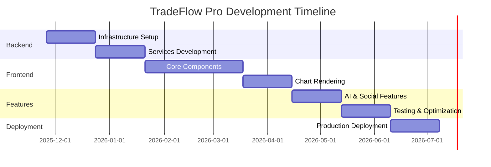

deFlow Pro - Complete Development Guide**
## **Professional Trading Platform: TradingView + Exocharts Hybrid**

**Version:** 1.0.0  
**Target Completion:** 24 weeks (6 months)  
**Last Updated:** November 26, 2025

---

## **TABLE OF CONTENTS**

1. [Executive Summary](#1-executive-summary)
2. [Technology Stack](#2-technology-stack)
3. [Phase 1: Backend Infrastructure (Weeks 1-4)](#3-phase-1-backend-infrastructure)
4. [Phase 2: Services Layer (Weeks 5-8)](#4-phase-2-services-layer)
5. [Phase 3: Frontend Architecture (Weeks 9-12)](#5-phase-3-frontend-architecture)
6. [Phase 4: Advanced Features (Weeks 13-16)](#6-phase-4-advanced-features)
7. [Phase 5: Testing Strategy (Weeks 17-20)](#7-phase-5-testing-strategy)
8. [Phase 6: Deployment & Scaling (Weeks 21-24)](#8-phase-6-deployment-and-scaling)
9. [Security & Compliance](#9-security-and-compliance)
10. [Performance Optimization](#10-performance-optimization)
11. [Monitoring & Observability](#11-monitoring-and-observability)
12. [Development Workflow](#12-development-workflow)

---

## **1. EXECUTIVE SUMMARY**

### **1.1 Project Goal**

Build a scalable, high-performance trading charting platform combining:
- **TradingView's** comprehensive analysis tools, social features, and multi-market coverage
- **Exocharts'** advanced order flow capabilities, volume profiling, and market microstructure analysis

### **1.2 Key Capabilities**

✅ **Real-time Data Processing**
- Tick-level market data ingestion (100,000+ ticks/second)
- Sub-second WebSocket updates
- Support for multiple asset classes (forex, crypto, stocks, futures)

✅ **Advanced Charting**
- 21+ chart types (candlestick, footprint, volume profile, market profile)
- 100+ technical indicators
- Custom indicator creation (JavaScript-based)
- Drawing tools and annotations

✅ **Order Flow Analysis**
- Bid/Ask volume tracking
- Cumulative Volume Delta (CVD)
- Volume footprint charts
- Liquidation tracking (crypto)
- Market depth visualization

✅ **Social Trading Features**
- Trading ideas sharing
- Follow traders
- Comments and discussions
- Public/private workspaces

✅ **AI-Powered Insights**
- Pattern recognition
- Market sentiment analysis
- Predictive analytics
- Automated strategy backtesting

### **1.3 Scale Requirements**

| Metric | Target |
|--------|--------|
| Concurrent Users | 1,000,000+ |
| Data Throughput | 100,000 ticks/sec |
| API Requests | 10,000 req/sec |
| Database Size | Petabyte-scale |
| API Latency | <100ms (p95) |
| WebSocket Latency | <50ms |
| Uptime SLA | 99.9% |

### **1.4 Timeline**



---

## **2. TECHNOLOGY STACK**

### **2.1 Backend**

```yaml
Language: Python 3.12+
Framework: FastAPI 0.104+
Web Server: Uvicorn + Gunicorn
API Gateway: Kong / Nginx
Async I/O: asyncio, aiohttp, aiomysql, asyncpg
```

### **2.2 Databases**

```yaml
Relational: MariaDB 11+ (Galera Cluster for HA)
Time-Series: TimescaleDB 2.13+ (PostgreSQL 16+)
Cache: Redis 7.2+ (Cluster mode)
Search: Elasticsearch 8.11+
```

### **2.3 Message Queue & Streaming**

```yaml
Stream Processing: Apache Kafka 3.6+
Task Queue: Celery 5.3+ with Redis
Real-time: WebSocket (native FastAPI)
```

### **2.4 Frontend**

```yaml
Framework: React 18+ with TypeScript 5.3+
State Management: Zustand + React Query
Charting: Custom WebGL/Canvas rendering
UI Framework: TailwindCSS 3.4+ + shadcn/ui
Build Tool: Vite 5+
Testing: Vitest + React Testing Library + Playwright
```

### **2.5 Infrastructure**

```yaml
Containerization: Docker 24+
Orchestration: Kubernetes 1.28+
Service Mesh: Istio 1.20+
CI/CD: GitHub Actions + ArgoCD
IaC: Terraform 1.6+
```

### **2.6 Monitoring**

```yaml
Metrics: Prometheus + VictoriaMetrics
Visualization: Grafana 10.2+
Logging: Loki + Promtail
Tracing: Jaeger / Tempo
APM: Sentry
Alerting: AlertManager + PagerDuty
```

---

## **3. PHASE 1: BACKEND INFRASTRUCTURE**
### **Duration: Weeks 1-4**

### **3.1 Database Design**

#### **3.1.1 MariaDB Schema (Relational Data)**

Complete schema provided in the attached SQL file. Key tables:

**Core Tables:**
- `users` - User accounts and authentication
- `symbols` - Trading symbols metadata
- `workspaces` - Chart layout configurations
- `saved_charts` - Saved chart configurations
- `custom_indicators` - User-created indicators
- `alerts` - Price and condition-based alerts
- `trading_ideas` - Social sharing content

**Relationships:**
```sql
CREATE DATABASE tradeflow_db CHARACTER SET utf8mb4 COLLATE utf8mb4_unicode_ci;
USE tradeflow_db;

-- Users table
CREATE TABLE users (
    id BIGINT UNSIGNED PRIMARY KEY AUTO_INCREMENT,
    email VARCHAR(255) UNIQUE NOT NULL,
    username VARCHAR(50) UNIQUE NOT NULL,
    password_hash VARCHAR(255) NOT NULL,
    subscription_tier ENUM('free', 'essential', 'plus', 'premium', 'pro') DEFAULT 'free',
    created_at TIMESTAMP DEFAULT CURRENT_TIMESTAMP,
    last_login TIMESTAMP NULL,
    is_active BOOLEAN DEFAULT TRUE,
    preferences JSON,
    INDEX idx_email (email),
    INDEX idx_username (username)
) ENGINE=InnoDB;

-- Symbols table
CREATE TABLE symbols (
    id INT UNSIGNED PRIMARY KEY AUTO_INCREMENT,
    symbol VARCHAR(50) NOT NULL,
    name VARCHAR(255),
    exchange VARCHAR(50),
    asset_type ENUM('forex', 'crypto', 'stocks', 'futures', 'commodities') NOT NULL,
    tick_size DECIMAL(20,8),
    is_active BOOLEAN DEFAULT TRUE,
    UNIQUE KEY unique_symbol_exchange (symbol, exchange),
    INDEX idx_symbol (symbol),
    INDEX idx_type (asset_type, is_active)
) ENGINE=InnoDB;

-- Workspaces table
CREATE TABLE workspaces (
    id BIGINT UNSIGNED PRIMARY KEY AUTO_INCREMENT,
    user_id BIGINT UNSIGNED NOT NULL,
    name VARCHAR(255) NOT NULL,
    layout_config JSON NOT NULL,
    is_default BOOLEAN DEFAULT FALSE,
    is_public BOOLEAN DEFAULT FALSE,
    created_at TIMESTAMP DEFAULT CURRENT_TIMESTAMP,
    FOREIGN KEY (user_id) REFERENCES users(id) ON DELETE CASCADE,
    INDEX idx_user_workspaces (user_id, created_at DESC)
) ENGINE=InnoDB;

-- Saved charts table
CREATE TABLE saved_charts (
    id BIGINT UNSIGNED PRIMARY KEY AUTO_INCREMENT,
    user_id BIGINT UNSIGNED NOT NULL,
    symbol_id INT UNSIGNED NOT NULL,
    timeframe VARCHAR(10) NOT NULL,
    chart_config JSON NOT NULL,
    indicators JSON,
    drawings JSON,
    created_at TIMESTAMP DEFAULT CURRENT_TIMESTAMP,
    FOREIGN KEY (user_id) REFERENCES users(id) ON DELETE CASCADE,
    FOREIGN KEY (symbol_id) REFERENCES symbols(id),
    INDEX idx_user_charts (user_id, created_at DESC)
) ENGINE=InnoDB;

-- Alerts table
CREATE TABLE alerts (
    id BIGINT UNSIGNED PRIMARY KEY AUTO_INCREMENT,
    user_id BIGINT UNSIGNED NOT NULL,
    symbol_id INT UNSIGNED NOT NULL,
    alert_type ENUM('price', 'indicator', 'pattern', 'orderflow') NOT NULL,
    condition_config JSON NOT NULL,
    notification_channels JSON,
    is_active BOOLEAN DEFAULT TRUE,
    created_at TIMESTAMP DEFAULT CURRENT_TIMESTAMP,
    FOREIGN KEY (user_id) REFERENCES users(id) ON DELETE CASCADE,
    FOREIGN KEY (symbol_id) REFERENCES symbols(id),
    INDEX idx_user_active_alerts (user_id, is_active),
    INDEX idx_symbol_alerts (symbol_id, is_active)
) ENGINE=InnoDB;
```

#### **3.1.2 TimescaleDB Schema (Time-Series Data)**

```sql
CREATE DATABASE market_data_db;
\c market_data_db;

-- Install TimescaleDB
CREATE EXTENSION IF NOT EXISTS timescaledb CASCADE;

-- Market data table (OHLCV + Order Flow)
CREATE TABLE market_data (
    time TIMESTAMPTZ NOT NULL,
    symbol VARCHAR(50) NOT NULL,
    timeframe VARCHAR(10) NOT NULL,
    open DOUBLE PRECISION NOT NULL,
    high DOUBLE PRECISION NOT NULL,
    low DOUBLE PRECISION NOT NULL,
    close DOUBLE PRECISION NOT NULL,
    volume DOUBLE PRECISION NOT NULL,
    bid_volume DOUBLE PRECISION,
    ask_volume DOUBLE PRECISION,
    number_of_trades INTEGER,
    open_interest DOUBLE PRECISION,
    source VARCHAR(100) DEFAULT 'sierra_chart',
    collected_at TIMESTAMPTZ DEFAULT NOW(),
    PRIMARY KEY (time, symbol, timeframe)
);

-- Convert to hypertable (TimescaleDB magic!)
SELECT create_hypertable('market_data', 'time', 
    chunk_time_interval => INTERVAL '1 day',
    if_not_exists => TRUE
);

-- Enable compression (saves 90%+ storage)
ALTER TABLE market_data SET (
    timescaledb.compress,
    timescaledb.compress_segmentby = 'symbol,timeframe',
    timescaledb.compress_orderby = 'time DESC'
);

-- Auto-compress data older than 7 days
SELECT add_compression_policy('market_data', INTERVAL '7 days');

-- Indexes for fast queries
CREATE INDEX idx_market_data_symbol_time ON market_data (symbol, time DESC);
CREATE INDEX idx_market_data_timeframe ON market_data (timeframe, time DESC);

-- Continuous aggregates (pre-computed timeframes)
CREATE MATERIALIZED VIEW market_data_1min
WITH (timescaledb.continuous) AS
SELECT 
    time_bucket('1 minute', time) AS bucket,
    symbol,
    FIRST(open, time) AS open,
    MAX(high) AS high,
    MIN(low) AS low,
    LAST(close, time) AS close,
    SUM(volume) AS volume,
    SUM(bid_volume) AS bid_volume,
    SUM(ask_volume) AS ask_volume,
    SUM(number_of_trades) AS number_of_trades,
    LAST(open_interest, time) AS open_interest
FROM market_data
WHERE timeframe = '1s'
GROUP BY bucket, symbol;

-- Auto-refresh policy
SELECT add_continuous_aggregate_policy('market_data_1min',
    start_offset => INTERVAL '1 hour',
    end_offset => INTERVAL '1 minute',
    schedule_interval => INTERVAL '1 minute'
);

-- Volume Profile table
CREATE TABLE volume_profile (
    time TIMESTAMPTZ NOT NULL,
    symbol VARCHAR(50) NOT NULL,
    session_start TIMESTAMPTZ NOT NULL,
    price_level DOUBLE PRECISION NOT NULL,
    volume DOUBLE PRECISION NOT NULL,
    bid_volume DOUBLE PRECISION,
    ask_volume DOUBLE PRECISION,
    PRIMARY KEY (time, symbol, session_start, price_level)
);

SELECT create_hypertable('volume_profile', 'time',
    chunk_time_interval => INTERVAL '1 day'
);

-- Market Profile (TPO) table
CREATE TABLE market_profile (
    time TIMESTAMPTZ NOT NULL,
    symbol VARCHAR(50) NOT NULL,
    session_start TIMESTAMPTZ NOT NULL,
    price_level DOUBLE PRECISION NOT NULL,
    tpo_count INTEGER NOT NULL,
    tpo_letters VARCHAR(100),
    PRIMARY KEY (time, symbol, session_start, price_level)
);

SELECT create_hypertable('market_profile', 'time',
    chunk_time_interval => INTERVAL '1 day'
);

-- Retention policies
SELECT add_retention_policy('market_data', INTERVAL '2 years');
SELECT add_retention_policy('volume_profile', INTERVAL '6 months');
```

### **3.2 Backend Project Structure**

```
tradeflow-backend/
├── app/
│   ├── __init__.py
│   ├── main.py                    # FastAPI app
│   ├── config.py                  # Settings
│   ├── dependencies.py            # DI
│   │
│   ├── api/v1/
│   │   ├── auth.py               # Login/register
│   │   ├── market_data.py        # Data ingestion
│   │   ├── charts.py             # Chart data
│   │   ├── indicators.py         # Technical indicators
│   │   ├── orderflow.py          # Order flow
│   │   ├── volume_profile.py     # Volume profile
│   │   ├── alerts.py             # Alerts
│   │   ├── workspaces.py         # Workspaces
│   │   ├── social.py             # Social features
│   │   └── websocket.py          # WebSocket
│   │
│   ├── services/
│   │   ├── market_data_service.py
│   │   ├── indicator_service.py
│   │   ├── orderflow_service.py
│   │   ├── volume_profile_service.py
│   │   ├── alert_service.py
│   │   └── websocket_service.py
│   │
│   ├── workers/
│   │   ├── celery_app.py
│   │   ├── data_aggregator.py
│   │   ├── indicator_calculator.py
│   │   └── alert_monitor.py
│   │
│   ├── core/
│   │   ├── security.py
│   │   ├── caching.py
│   │   └── monitoring.py
│   │
│   └── tests/
│       ├── unit/
│       ├── integration/
│       └── load/
│
├── docker/
│   ├── Dockerfile
│   ├── docker-compose.yml
│   └── nginx.conf
│
├── requirements.txt
└── README.md
```

### **3.3 Core Backend Files**

#### **app/main.py**

```python
from fastapi import FastAPI, Request, status
from fastapi.middleware.cors import CORSMiddleware
from fastapi.middleware.gzip import GZipMiddleware
from contextlib import asynccontextmanager
import logging
import time

from app.api.v1 import (
    auth, market_data, charts, indicators,
    orderflow, volume_profile, alerts,
    workspaces, social, websocket
)
from app.core.config import settings
from app.core.monitoring import setup_monitoring
from app.db.mariadb import mariadb_manager
from app.db.timescale import timescale_manager
from app.db.redis import redis_manager

logging.basicConfig(level=logging.INFO)
logger = logging.getLogger(__name__)

@asynccontextmanager
async def lifespan(app: FastAPI):
    # Startup
    logger.info("Starting TradeFlow Pro API...")
    await mariadb_manager.connect()
    await timescale_manager.connect()
    await redis_manager.connect()
    setup_monitoring(app)
    logger.info("✓ All systems operational")
    
    yield
    
    # Shutdown
    logger.info("Shutting down...")
    await mariadb_manager.disconnect()
    await timescale_manager.disconnect()
    await redis_manager.disconnect()

app = FastAPI(
    title="TradeFlow Pro API",
    version="1.0.0",
    lifespan=lifespan
)

# Middleware
app.add_middleware(
    CORSMiddleware,
    allow_origins=settings.ALLOWED_ORIGINS,
    allow_credentials=True,
    allow_methods=["*"],
    allow_headers=["*"],
)
app.add_middleware(GZipMiddleware, minimum_size=1000)

@app.middleware("http")
async def add_process_time(request: Request, call_next):
    start = time.time()
    response = await call_next(request)
    process_time = time.time() - start
    response.headers["X-Process-Time"] = f"{process_time:.3f}"
    return response

@app.get("/health")
async def health_check():
    return {"status": "healthy"}

# Include routers
app.include_router(auth.router, prefix="/api/v1/auth", tags=["Auth"])
app.include_router(market_data.router, prefix="/api/v1/market-data", tags=["Market Data"])
app.include_router(charts.router, prefix="/api/v1/charts", tags=["Charts"])
app.include_router(indicators.router, prefix="/api/v1/indicators", tags=["Indicators"])
app.include_router(orderflow.router, prefix="/api/v1/orderflow", tags=["Order Flow"])
app.include_router(volume_profile.router, prefix="/api/v1/volume-profile", tags=["Volume Profile"])
app.include_router(alerts.router, prefix="/api/v1/alerts", tags=["Alerts"])
app.include_router(workspaces.router, prefix="/api/v1/workspaces", tags=["Workspaces"])
app.include_router(social.router, prefix="/api/v1/social", tags=["Social"])
app.include_router(websocket.router, prefix="/api/v1/ws", tags=["WebSocket"])

if __name__ == "__main__":
    import uvicorn
    uvicorn.run("app.main:app", host="0.0.0.0", port=8000, reload=True)
```

#### **app/config.py**

```python
from pydantic_settings import BaseSettings
from typing import List
from functools import lru_cache

class Settings(BaseSettings):
    # App
    APP_NAME: str = "TradeFlow Pro"
    ENVIRONMENT: str = "development"
    SECRET_KEY: str
    
    # CORS
    ALLOWED_ORIGINS: List[str] = ["http://localhost:3000"]
    
    # MariaDB
    MARIADB_HOST: str = "localhost"
    MARIADB_PORT: int = 3306
    MARIADB_USER: str = "tradeflow"
    MARIADB_PASSWORD: str
    MARIADB_DATABASE: str = "tradeflow_db"
    
    # TimescaleDB
    TIMESCALE_HOST: str = "localhost"
    TIMESCALE_PORT: int = 5432
    TIMESCALE_USER: str = "tradeflow"
    TIMESCALE_PASSWORD: str
    TIMESCALE_DATABASE: str = "market_data_db"
    
    # Redis
    REDIS_HOST: str = "localhost"
    REDIS_PORT: int = 6379
    REDIS_PASSWORD: str = ""
    
    # JWT
    JWT_SECRET_KEY: str
    ACCESS_TOKEN_EXPIRE_MINUTES: int = 30
    
    # Rate Limiting
    RATE_LIMIT_PER_MINUTE: int = 60
    
    # WebSocket
    WS_MAX_CONNECTIONS_PER_USER: int = 5
    
    # Caching
    CACHE_TTL_MARKET_DATA: int = 1  # seconds
    CACHE_TTL_INDICATORS: int = 5
    
    @property
    def MARIADB_URL(self) -> str:
        return f"mysql+aiomysql://{self.MARIADB_USER}:{self.MARIADB_PASSWORD}@{self.MARIADB_HOST}:{self.MARIADB_PORT}/{self.MARIADB_DATABASE}"
    
    @property
    def TIMESCALE_URL(self) -> str:
        return f"postgresql+asyncpg://{self.TIMESCALE_USER}:{self.TIMESCALE_PASSWORD}@{self.TIMESCALE_HOST}:{self.TIMESCALE_PORT}/{self.TIMESCALE_DATABASE}"
    
    class Config:
        env_file = ".env"

@lru_cache()
def get_settings() -> Settings:
    return Settings()

settings = get_settings()
```

#### **app/api/v1/market_data.py** (Sierra Chart Receiver)

```python
from fastapi import APIRouter, Header, HTTPException, BackgroundTasks, Depends
from pydantic import BaseModel, Field
from typing import Optional, List
from datetime import datetime
import logging

from app.core.security import verify_api_key
from app.services.market_data_service import MarketDataService

router = APIRouter()
logger = logging.getLogger(__name__)

class ChartInfo(BaseModel):
    symbol: str
    chart_number: int
    seconds_per_bar: int

class SierraChartBar(BaseModel):
    timestamp: str
    open: float
    high: float
    low: float
    close: float
    volume: float
    bid_volume: Optional[float] = None
    ask_volume: Optional[float] = None
    number_of_trades: Optional[int] = None
    open_interest: Optional[float] = None
    chart_info: ChartInfo
    
    @classmethod
    def parse_timestamp(cls, v):
        """Parse Sierra Chart timestamp: '2025-11-26 21:17:14'"""
        try:
            return datetime.strptime(v, "%Y-%m-%d %H:%M:%S")
        except:
            return datetime.fromisoformat(v.replace('Z', '+00:00'))

class SierraChartBatch(BaseModel):
    data: List[SierraChartBar]
    metadata: dict

@router.post("/")
async def receive_market_data(
    request: SierraChartBar,
    background_tasks: BackgroundTasks,
    x_api_key: Optional[str] = Header(None),
    service: MarketDataService = Depends()
):
    """
    Receive single bar from Sierra Chart
    
    Sierra Chart posts to this endpoint in real-time mode
    """
    # Verify API key
    if not verify_api_key(x_api_key):
        raise HTTPException(status_code=401, detail="Invalid API key")
    
    symbol = request.chart_info.symbol
    timeframe = f"{request.chart_info.seconds_per_bar}s"
    timestamp = request.parse_timestamp(request.timestamp)
    
    logger.info(f"Received bar: {symbol} @ {timestamp} ({timeframe})")
    
    # Store in TimescaleDB
    await service.store_bar(
        symbol=symbol,
        timeframe=timeframe,
        timestamp=timestamp,
        open=request.open,
        high=request.high,
        low=request.low,
        close=request.close,
        volume=request.volume,
        bid_volume=request.bid_volume,
        ask_volume=request.ask_volume,
        number_of_trades=request.number_of_trades,
        open_interest=request.open_interest
    )
    
    # Schedule background tasks
    background_tasks.add_task(
        service.aggregate_to_higher_timeframes,
        symbol, timeframe, timestamp
    )
    
    background_tasks.add_task(
        service.update_volume_profile,
        symbol, timestamp, request.close, request.volume,
        request.bid_volume, request.ask_volume
    )
    
    background_tasks.add_task(
        service.broadcast_tick,
        symbol, request.dict()
    )
    
    return {
        "status": "success",
        "symbol": symbol,
        "timeframe": timeframe
    }

@router.post("/batch")
async def receive_batch(
    request: SierraChartBatch,
    background_tasks: BackgroundTasks,
    x_api_key: Optional[str] = Header(None),
    service: MarketDataService = Depends()
):
    """
    Receive batch from Sierra Chart (Historical mode)
    
    Sierra Chart sends 50-100 bars per batch
    """
    if not verify_api_key(x_api_key):
        raise HTTPException(status_code=401, detail="Invalid API key")
    
    symbol = request.data[0].chart_info.symbol
    logger.info(f"Received batch: {len(request.data)} bars for {symbol}")
    
    # Bulk insert (fast!)
    stored_count = await service.store_batch(request.data)
    
    return {
        "status": "success",
        "bars_received": len(request.data),
        "bars_stored": stored_count,
        "symbol": symbol
    }

@router.get("/{symbol}")
async def get_market_data(
    symbol: str,
    timeframe: str = "1m",
    limit: int = 500,
    service: MarketDataService = Depends()
):
    """
    Get market data for charting
    
    Supports all timeframes: 1s, 5s, 1m, 5m, 15m, 1h, 4h, 1d, 1w
    """
    bars = await service.get_bars(symbol, timeframe, limit)
    return bars
```

---

## **4. PHASE 2: SERVICES LAYER**
### **Duration: Weeks 5-8**

### **4.1 Market Data Service**

```python
# app/services/market_data_service.py
from typing import List, Optional
from datetime import datetime
import logging

from app.db.timescale import timescale_manager
from app.db.redis import redis_manager
from app.core.caching import cache_key

logger = logging.getLogger(__name__)

class MarketDataService:
    async def store_bar(
        self,
        symbol: str,
        timeframe: str,
        timestamp: datetime,
        open: float,
        high: float,
        low: float,
        close: float,
        volume: float,
        bid_volume: Optional[float] = None,
        ask_volume: Optional[float] = None,
        number_of_trades: Optional[int] = None,
        open_interest: Optional[float] = None
    ):
        """Store single bar in TimescaleDB"""
        query = """
            INSERT INTO market_data (
                time, symbol, timeframe, open, high, low, close,
                volume, bid_volume, ask_volume, number_of_trades, open_interest
            ) VALUES ($1, $2, $3, $4, $5, $6, $7, $8, $9, $10, $11, $12)
            ON CONFLICT (time, symbol, timeframe) DO UPDATE SET
                open = EXCLUDED.open,
                high = EXCLUDED.high,
                low = EXCLUDED.low,
                close = EXCLUDED.close,
                volume = EXCLUDED.volume,
                bid_volume = EXCLUDED.bid_volume,
                ask_volume = EXCLUDED.ask_volume,
                number_of_trades = EXCLUDED.number_of_trades,
                open_interest = EXCLUDED.open_interest
        """
        
        await timescale_manager.execute(
            query,
            timestamp, symbol, timeframe, open, high, low, close,
            volume, bid_volume, ask_volume, number_of_trades, open_interest
        )
        
        # Invalidate cache
        cache_key_pattern = f"market_data:{symbol}:*"
        await redis_manager.delete_pattern(cache_key_pattern)
    
    async def store_batch(self, bars: List) -> int:
        """Bulk insert for historical data"""
        values = []
        for bar in bars:
            timestamp = bar.parse_timestamp(bar.timestamp)
            symbol = bar.chart_info.symbol
            timeframe = f"{bar.chart_info.seconds_per_bar}s"
            
            values.append((
                timestamp, symbol, timeframe,
                bar.open, bar.high, bar.low, bar.close,
                bar.volume, bar.bid_volume, bar.ask_volume,
                bar.number_of_trades, bar.open_interest
            ))
        
        # Use COPY for fast bulk insert
        query = """
            INSERT INTO market_data (
                time, symbol, timeframe, open, high, low, close,
                volume, bid_volume, ask_volume, number_of_trades, open_interest
            ) VALUES ($1, $2, $3, $4, $5, $6, $7, $8, $9, $10, $11, $12)
        """
        
        await timescale_manager.executemany(query, values)
        return len(values)
    
    async def get_bars(
        self,
        symbol: str,
        timeframe: str,
        limit: int = 500
    ) -> List[dict]:
        """Get OHLCV bars (with caching)"""
        # Check cache first
        cache_key_str = cache_key("market_data", symbol, timeframe, limit)
        cached = await redis_manager.get(cache_key_str)
        if cached:
            return cached
        
        # Query from database
        query = """
            SELECT time, open, high, low, close, volume,
                   bid_volume, ask_volume, number_of_trades
            FROM market_data
            WHERE symbol = $1 AND timeframe = $2
            ORDER BY time DESC
            LIMIT $3
        """
        
        rows = await timescale_manager.fetch_all(query, symbol, timeframe, limit)
        
        bars = [
            {
                "timestamp": row["time"].isoformat(),
                "open": float(row["open"]),
                "high": float(row["high"]),
                "low": float(row["low"]),
                "close": float(row["close"]),
                "volume": float(row["volume"]),
                "bid_volume": float(row["bid_volume"]) if row["bid_volume"] else None,
                "ask_volume": float(row["ask_volume"]) if row["ask_volume"] else None
            }
            for row in rows
        ]
        
        # Cache for 1 second
        await redis_manager.set(cache_key_str, bars, ttl=1)
        
        return bars
    
    async def aggregate_to_higher_timeframes(
        self,
        symbol: str,
        base_timeframe: str,
        timestamp: datetime
    ):
        """
        Background task: Aggregate tick data to higher timeframes
        
        Example: 1s -> 1m, 5m, 15m, 1h, 4h, 1d
        """
        # This triggers TimescaleDB continuous aggregates
        # They auto-refresh based on policies we set
        logger.info(f"Triggering aggregation for {symbol}")
    
    async def update_volume_profile(
        self,
        symbol: str,
        timestamp: datetime,
        price: float,
        volume: float,
        bid_volume: Optional[float],
        ask_volume: Optional[float]
    ):
        """Update volume profile for current session"""
        # Determine session start (e.g., 00:00 UTC for daily)
        session_start = timestamp.replace(hour=0, minute=0, second=0, microsecond=0)
        
        # Round price to tick size (e.g., 0.01 for forex)
        tick_size = 0.01
        price_level = round(price / tick_size) * tick_size
        
        query = """
            INSERT INTO volume_profile (
                time, symbol, session_start, price_level,
                volume, bid_volume, ask_volume
            ) VALUES ($1, $2, $3, $4, $5, $6, $7)
            ON CONFLICT (time, symbol, session_start, price_level) DO UPDATE SET
                volume = volume_profile.volume + EXCLUDED.volume,
                bid_volume = volume_profile.bid_volume + EXCLUDED.bid_volume,
                ask_volume = volume_profile.ask_volume + EXCLUDED.ask_volume
        """
        
        await timescale_manager.execute(
            query,
            timestamp, symbol, session_start, price_level,
            volume, bid_volume or 0, ask_volume or 0
        )
    
    async def broadcast_tick(self, symbol: str, data: dict):
        """Broadcast tick to WebSocket clients"""
        from app.services.websocket_service import ws_manager
        await ws_manager.broadcast_to_symbol(symbol, {
            "type": "tick",
            "symbol": symbol,
            "data": data
        })
```

### **4.2 Indicator Service**

```python
# app/services/indicator_service.py
import numpy as np
import pandas as pd
from typing import List, Dict, Any

class IndicatorService:
    def calculate_sma(self, closes: List[float], period: int) -> List[float]:
        """Simple Moving Average"""
        return pd.Series(closes).rolling(window=period).mean().tolist()
    
    def calculate_ema(self, closes: List[float], period: int) -> List[float]:
        """Exponential Moving Average"""
        return pd.Series(closes).ewm(span=period, adjust=False).mean().tolist()
    
    def calculate_rsi(self, closes: List[float], period: int = 14) -> List[float]:
        """Relative Strength Index"""
        closes_series = pd.Series(closes)
        delta = closes_series.diff()
        gain = (delta.where(delta > 0, 0)).rolling(window=period).mean()
        loss = (-delta.where(delta < 0, 0)).rolling(window=period).mean()
        rs = gain / loss
        rsi = 100 - (100 / (1 + rs))
        return rsi.tolist()
    
    def calculate_macd(
        self,
        closes: List[float],
        fast: int = 12,
        slow: int = 26,
        signal: int = 9
    ) -> Dict[str, List[float]]:
        """MACD"""
        closes_series = pd.Series(closes)
        ema_fast = closes_series.ewm(span=fast, adjust=False).mean()
        ema_slow = closes_series.ewm(span=slow, adjust=False).mean()
        macd_line = ema_fast - ema_slow
        signal_line = macd_line.ewm(span=signal, adjust=False).mean()
        histogram = macd_line - signal_line
        
        return {
            "macd": macd_line.tolist(),
            "signal": signal_line.tolist(),
            "histogram": histogram.tolist()
        }
    
    def calculate_bollinger_bands(
        self,
        closes: List[float],
        period: int = 20,
        std_dev: float = 2.0
    ) -> Dict[str, List[float]]:
        """Bollinger Bands"""
        closes_series = pd.Series(closes)
        sma = closes_series.rolling(window=period).mean()
        std = closes_series.rolling(window=period).std()
        
        upper = sma + (std * std_dev)
        lower = sma - (std * std_dev)
        
        return {
            "upper": upper.tolist(),
            "middle": sma.tolist(),
            "lower": lower.tolist()
        }
    
    def calculate_atr(
        self,
        highs: List[float],
        lows: List[float],
        closes: List[float],
        period: int = 14
    ) -> List[float]:
        """Average True Range"""
        high = pd.Series(highs)
        low = pd.Series(lows)
        close = pd.Series(closes)
        
        tr1 = high - low
        tr2 = abs(high - close.shift())
        tr3 = abs(low - close.shift())
        
        true_range = pd.concat([tr1, tr2, tr3], axis=1).max(axis=1)
        atr = true_range.rolling(window=period).mean()
        
        return atr.tolist()
```

### **4.3 Order Flow Service**

```python
# app/services/orderflow_service.py
from typing import List, Dict
from datetime import datetime

class OrderFlowService:
    async def get_footprint_data(
        self,
        symbol: str,
        start_time: datetime,
        end_time: datetime
    ) -> List[Dict]:
        """
        Get footprint data (bid/ask volume at each price level)
        
        Returns: [
            {
                "timestamp": "2025-11-26T21:17:14",
                "price": 4162.58,
                "bid_volume": 15,
                "ask_volume": 4,
                "delta": 11,
                "imbalance_ratio": 0.73
            },
            ...
        ]
        """
        from app.db.timescale import timescale_manager
        
        query = """
            SELECT 
                time,
                FLOOR(close / $4) * $4 AS price_level,
                SUM(COALESCE(bid_volume, 0)) AS bid_vol,
                SUM(COALESCE(ask_volume, 0)) AS ask_vol,
                SUM(COALESCE(bid_volume, 0)) - SUM(COALESCE(ask_volume, 0)) AS delta
            FROM market_data
            WHERE symbol = $1
                AND time BETWEEN $2 AND $3
            GROUP BY time, price_level
            ORDER BY time, price_level
        """
        
        tick_size = 0.01
        rows = await timescale_manager.fetch_all(
            query, symbol, start_time, end_time, tick_size
        )
        
        result = []
        for row in rows:
            bid_vol = float(row["bid_vol"])
            ask_vol = float(row["ask_vol"])
            total = bid_vol + ask_vol
            
            result.append({
                "timestamp": row["time"].isoformat(),
                "price": float(row["price_level"]),
                "bid_volume": bid_vol,
                "ask_volume": ask_vol,
                "delta": float(row["delta"]),
                "imbalance_ratio": bid_vol / total if total > 0 else 0.5
            })
        
        return result
    
    async def calculate_cumulative_delta(
        self,
        symbol: str,
        timeframe: str,
        limit: int = 500
    ) -> List[Dict]:
        """
        Calculate Cumulative Volume Delta (CVD)
        
        CVD = Σ(bid_volume - ask_volume)
        """
        from app.db.timescale import timescale_manager
        
        query = """
            SELECT 
                time,
                COALESCE(bid_volume, 0) - COALESCE(ask_volume, 0) AS delta,
                SUM(COALESCE(bid_volume, 0) - COALESCE(ask_volume, 0)) 
                    OVER (ORDER BY time) AS cumulative_delta
            FROM market_data
            WHERE symbol = $1 AND timeframe = $2
            ORDER BY time DESC
            LIMIT $3
        """
        
        rows = await timescale_manager.fetch_all(query, symbol, timeframe, limit)
        
        return [
            {
                "timestamp": row["time"].isoformat(),
                "delta": float(row["delta"]),
                "cumulative_delta": float(row["cumulative_delta"])
            }
            for row in rows
        ]
```

### **4.4 Volume Profile Service**

```python
# app/services/volume_profile_service.py
from typing import List, Dict
from datetime import datetime

class VolumeProfileService:
    async def get_volume_profile(
        self,
        symbol: str,
        session_start: datetime,
        session_end: datetime
    ) -> Dict:
        """
        Get volume profile for a trading session
        
        Returns:
        {
            "poc": 4162.50,  # Point of Control
            "vah": 4165.00,  # Value Area High
            "val": 4160.00,  # Value Area Low
            "profile": [
                {"price": 4160.00, "volume": 1250, "percent": 5.2},
                {"price": 4160.50, "volume": 2340, "percent": 9.7},
                ...
            ]
        }
        """
        from app.db.timescale import timescale_manager
        
        # Get volume distribution
        query = """
            SELECT 
                price_level,
                SUM(volume) AS total_volume,
                SUM(bid_volume) AS total_bid,
                SUM(ask_volume) AS total_ask
            FROM volume_profile
            WHERE symbol = $1
                AND session_start = $2
            GROUP BY price_level
            ORDER BY price_level
        """
        
        rows = await timescale_manager.fetch_all(query, symbol, session_start)
        
        if not rows:
            return {"poc": None, "vah": None, "val": None, "profile": []}
        
        # Calculate total volume
        total_volume = sum(float(row["total_volume"]) for row in rows)
        
        # Find POC (Point of Control - price with highest volume)
        poc_row = max(rows, key=lambda r: float(r["total_volume"]))
        poc_price = float(poc_row["price_level"])
        
        # Calculate Value Area (70% of volume around POC)
        target_volume = total_volume * 0.70
        profile_sorted = sorted(rows, key=lambda r: float(r["total_volume"]), reverse=True)
        
        va_volume = 0
        va_prices = []
        for row in profile_sorted:
            va_volume += float(row["total_volume"])
            va_prices.append(float(row["price_level"]))
            if va_volume >= target_volume:
                break
        
        vah = max(va_prices) if va_prices else poc_price
        val = min(va_prices) if va_prices else poc_price
        
        # Build profile
        profile = [
            {
                "price": float(row["price_level"]),
                "volume": float(row["total_volume"]),
                "bid_volume": float(row["total_bid"]),
                "ask_volume": float(row["total_ask"]),
                "percent": (float(row["total_volume"]) / total_volume) * 100
            }
            for row in rows
        ]
        
        return {
            "poc": poc_price,
            "vah": vah,
            "val": val,
            "total_volume": total_volume,
            "profile": profile
        }
```

---

## **5. PHASE 3: FRONTEND ARCHITECTURE**
### **Duration: Weeks 9-12**

### **5.1 Project Structure**

```
tradeflow-frontend/
├── src/
│   ├── app/
│   │   ├── layout.tsx
│   │   ├── page.tsx
│   │   └── globals.css
│   │
│   ├── components/
│   │   ├── chart/
│   │   │   ├── ChartContainer.tsx
│   │   │   ├── ChartCanvas.tsx
│   │   │   ├── ChartControls.tsx
│   │   │   ├── PriceScale.tsx
│   │   │   └── TimeScale.tsx
│   │   │
│   │   ├── indicators/
│   │   │   ├── IndicatorPanel.tsx
│   │   │   └── IndicatorSettings.tsx
│   │   │
│   │   ├── orderflow/
│   │   │   ├── FootprintChart.tsx
│   │   │   ├── VolumeProfile.tsx
│   │   │   └── MarketProfile.tsx
│   │   │
│   │   ├── workspace/
│   │   │   ├─ WorkspaceLayout.tsx
│   │   │   └── PanelManager.tsx
│   │   │
│   │   └── ui/
│   │       ├── button.tsx
│   │       ├── input.tsx
│   │       └── ... (shadcn/ui components)
│   │
│   ├── lib/
│   │   ├── chart-engine/
│   │   │   ├── renderer.ts
│   │   │   ├── indicators.ts
│   │   │   ├── drawings.ts
│   │   │   └── orderflow.ts
│   │   │
│   │   ├── api/
│   │   │   ├── client.ts
│   │   │   └── websocket.ts
│   │   │
│   │   └── utils/
│   │       ├── calculations.ts
│   │       └── formatting.ts
│   │
│   ├── hooks/
│   │   ├── useMarketData.ts
│   │   ├── useWebSocket.ts
│   │   ├── useIndicators.ts
│   │   └── useChart.ts
│   │
│   ├── store/
│   │   ├── chartStore.ts
│   │   ├── userStore.ts
│   │   └── workspaceStore.ts
│   │
│   └── types/
│       ├── chart.ts
│       ├── market-data.ts
│       └── user.ts
│
├── public/
├── package.json
├── tsconfig.json
├── tailwind.config.ts
└── vite.config.ts
```

### **5.2 Chart Rendering Engine**

```typescript
// src/lib/chart-engine/renderer.ts
import { Bar, Indicator, Drawing } from '@/types/chart';

export class ChartRenderer {
  private canvas: HTMLCanvasElement;
  private ctx: CanvasRenderingContext2D;
  private width: number;
  private height: number;
  private priceScale: PriceScale;
  private timeScale: TimeScale;
  
  constructor(canvas: HTMLCanvasElement) {
    this.canvas = canvas;
    this.ctx = canvas.getContext('2d')!;
    this.width = canvas.width;
    this.height = canvas.height;
    
    // Setup scales
    this.priceScale = new PriceScale(this.height);
    this.timeScale = new TimeScale(this.width);
  }
  
  render(bars: Bar[], indicators: Indicator[], drawings: Drawing[]) {
    // Clear canvas
    this.ctx.clearRect(0, 0, this.width, this.height);
    
    // Draw grid
    this.drawGrid();
    
    // Draw candlesticks
    this.drawCandlesticks(bars);
    
    // Draw indicators
    indicators.forEach(indicator => {
      this.drawIndicator(indicator, bars);
    });
    
    // Draw user drawings
    drawings.forEach(drawing => {
      this.drawDrawing(drawing);
    });
  }
  
  private drawCandlesticks(bars: Bar[]) {
    bars.forEach((bar, index) => {
      const x = this.timeScale.timeToX(bar.timestamp);
      const yHigh = this.priceScale.priceToY(bar.high);
      const yLow = this.priceScale.priceToY(bar.low);
      const yOpen = this.priceScale.priceToY(bar.open);
      const yClose = this.priceScale.priceToY(bar.close);
      
      // Candle color
      const isGreen = bar.close > bar.open;
      this.ctx.fillStyle = isGreen ? '#26a69a' : '#ef5350';
      this.ctx.strokeStyle = isGreen ? '#26a69a' : '#ef5350';
      
      // Draw wick
      this.ctx.beginPath();
      this.ctx.moveTo(x, yHigh);
      this.ctx.lineTo(x, yLow);
      this.ctx.stroke();
      
      // Draw body
      const bodyHeight = Math.abs(yClose - yOpen);
      const bodyY = Math.min(yOpen, yClose);
      this.ctx.fillRect(x - 4, bodyY, 8, bodyHeight);
    });
  }
  
  private drawIndicator(indicator: Indicator, bars: Bar[]) {
    switch (indicator.type) {
      case 'sma':
        this.drawLine(indicator.values, indicator.color);
        break;
      case 'ema':
        this.drawLine(indicator.values, indicator.color);
        break;
      case 'rsi':
        this.drawOscillator(indicator.values, indicator.color);
        break;
      // ... more indicators
    }
  }
  
  private drawLine(values: number[], color: string) {
    this.ctx.strokeStyle = color;
    this.ctx.lineWidth = 2;
    this.ctx.beginPath();
    
    values.forEach((value, index) => {
      if (value === null) return;
      
      const x = this.timeScale.indexToX(index);
      const y = this.priceScale.priceToY(value);
      
      if (index === 0) {
        this.ctx.moveTo(x, y);
      } else {
        this.ctx.lineTo(x, y);
      }
    });
    
    this.ctx.stroke();
  }
  
  private drawGrid() {
    this.ctx.strokeStyle = '#2a2e39';
    this.ctx.lineWidth = 1;
    
    // Horizontal lines
    for (let y = 0; y < this.height; y += 50) {
      this.ctx.beginPath();
      this.ctx.moveTo(0, y);
      this.ctx.lineTo(this.width, y);
      this.ctx.stroke();
    }
    
    // Vertical lines
    for (let x = 0; x < this.width; x += 50) {
      this.ctx.beginPath();
      this.ctx.moveTo(x, 0);
      this.ctx.lineTo(x, this.height);
      this.ctx.stroke();
    }
  }
}

class PriceScale {
  constructor(private height: number) {}
  
  priceToY(price: number): number {
    // Convert price to Y coordinate
    // Implementation depends on visible price range
    return this.height / 2; // Placeholder
  }
}

class TimeScale {
  constructor(private width: number) {}
  
  timeToX(timestamp: Date): number {
    // Convert timestamp to X coordinate
    return 0; // Placeholder
  }
  
  indexToX(index: number): number {
    // Convert bar index to X coordinate
    return index * 10; // Placeholder
  }
}
```

### **5.3 Footprint Chart Component**

```typescript
// src/components/orderflow/FootprintChart.tsx
import React, { useEffect, useRef } from 'react';
import { useQuery } from '@tanstack/react-query';
import { getFootprintData } from '@/lib/api/client';

interface FootprintProps {
  symbol: string;
  startTime: Date;
  endTime: Date;
}

export function FootprintChart({ symbol, startTime, endTime }: FootprintProps) {
  const canvasRef = useRef<HTMLCanvasElement>(null);
  
  const { data: footprint } = useQuery({
    queryKey: ['footprint', symbol, startTime, endTime],
    queryFn: () => getFootprintData(symbol, startTime, endTime),
    refetchInterval: 1000 // Update every second
  });
  
  useEffect(() => {
    if (!canvasRef.current || !footprint) return;
    
    const canvas = canvasRef.current;
    const ctx = canvas.getContext('2d')!;
    
    // Clear canvas
    ctx.clearRect(0, 0, canvas.width, canvas.height);
    
    // Draw footprint heatmap
    footprint.forEach((tick, index) => {
      const x = index * 10;
      const y = priceToY(tick.price);
      
      // Color based on imbalance
      const ratio = tick.imbalance_ratio;
      const color = ratio > 0.6 
        ? `rgba(38, 166, 154, ${ratio})` // Green for bid
        : `rgba(239, 83, 80, ${1 - ratio})`; // Red for ask
      
      // Draw cell
      ctx.fillStyle = color;
      ctx.fillRect(x, y, 10, 10);
      
      // Draw volume text
      ctx.fillStyle = '#ffffff';
      ctx.font = '8px monospace';
      ctx.fillText(
        `B:${tick.bid_volume}\nA:${tick.ask_volume}`,
        x + 2,
        y + 8
      );
    });
  }, [footprint]);
  
  function priceToY(price: number): number {
    // Convert price to Y coordinate
    return 100; // Placeholder
  }
  
  return (
    <canvas
      ref={canvasRef}
      width={800}
      height={600}
      className="border rounded"
    />
  );
}
```

### **5.4 WebSocket Hook**

```typescript
// src/hooks/useWebSocket.ts
import { useEffect, useRef, useState } from 'react';

interface WebSocketMessage {
  type: string;
  symbol: string;
  data: any;
}

export function useWebSocket(url: string, symbol: string) {
  const ws = useRef<WebSocket | null>(null);
  const [lastMessage, setLastMessage] = useState<WebSocketMessage | null>(null);
  const [isConnected, setIsConnected] = useState(false);
  
  useEffect(() => {
    // Connect to WebSocket
    ws.current = new WebSocket(url);
    
    ws.current.onopen = () => {
      console.log('WebSocket connected');
      setIsConnected(true);
      
      // Subscribe to symbol
      ws.current?.send(JSON.stringify({
        action: 'subscribe',
        symbol: symbol
      }));
    };
    
    ws.current.onmessage = (event) => {
      const message = JSON.parse(event.data);
      setLastMessage(message);
    };
    
    ws.current.onerror = (error) => {
      console.error('WebSocket error:', error);
    };
    
    ws.current.onclose = () => {
      console.log('WebSocket disconnected');
      setIsConnected(false);
    };
    
    // Cleanup
    return () => {
      ws.current?.close();
    };
  }, [url, symbol]);
  
  return { lastMessage, isConnected };
}
```

---

## **6. PHASE 4: ADVANCED FEATURES**
### **Duration: Weeks 13-16**

### **6.1 AI Pattern Recognition**

```python
# app/services/ai_service.py
import torch
import torch.nn as nn
from typing import List, Dict
import numpy as np

class PatternRecognitionModel(nn.Module):
    def __init__(self):
        super().__init__()
        self.conv1 = nn.Conv1d(5, 16, kernel_size=3)  # OHLCV inputs
        self.conv2 = nn.Conv1d(16, 32, kernel_size=3)
        self.fc1 = nn.Linear(32 * 46, 128)
        self.fc2 = nn.Linear(128, 10)  # 10 pattern types
        
    def forward(self, x):
        x = torch.relu(self.conv1(x))
        x = torch.relu(self.conv2(x))
        x = x.view(x.size(0), -1)
        x = torch.relu(self.fc1(x))
        x = self.fc2(x)
        return torch.softmax(x, dim=1)

class AIService:
    def __init__(self):
        self.model = PatternRecognitionModel()
        self.model.eval()
        
        self.pattern_names = [
            'head_and_shoulders',
            'double_top',
            'double_bottom',
            'triangle',
            'wedge',
            'flag',
            'pennant',
            'cup_and_handle',
            'inverse_head_shoulders',
            'none'
        ]
    
    async def detect_patterns(
        self,
        bars: List[Dict],
        confidence_threshold: float = 0.75
    ) -> List[Dict]:
        """
        Detect chart patterns using CNN
        
        Returns:
        [
            {
                "pattern": "head_and_shoulders",
                "confidence": 0.87,
                "start_index": 120,
                "end_index": 150
            },
            ...
        ]
        """
        # Prepare data
        ohlcv = np.array([
            [b['open'], b['high'], b['low'], b['close'], b['volume']]
            for b in bars
        ])
        
        # Normalize
        ohlcv = (ohlcv - ohlcv.mean(axis=0)) / ohlcv.std(axis=0)
        
        # Convert to tensor
        x = torch.tensor(ohlcv.T, dtype=torch.float32).unsqueeze(0)
        
        # Predict
        with torch.no_grad():
            predictions = self.model(x)
        
        # Get top predictions
        probs, indices = predictions.topk(3)
        
        results = []
        for prob, idx in zip(probs[0], indices[0]):
            if prob.item() >= confidence_threshold:
                results.append({
                    "pattern": self.pattern_names[idx],
                    "confidence": prob.item(),
                    "start_index": 0,  # TODO: Calculate actual start
                    "end_index": len(bars) - 1
                })
        
        return results
```

### **6.2 Alert System**

```python
# app/workers/alert_monitor.py
from celery import Celery
from datetime import datetime
import logging

from app.core.config import settings
from app.db.mariadb import mariadb_manager
from app.db.timescale import timescale_manager

logger = logging.getLogger(__name__)

celery_app = Celery('alerts', broker=settings.CELERY_BROKER_URL)

@celery_app.task
async def check_alerts():
    """
    Background task: Check all active alerts
    Run every second
    """
    # Get all active alerts
    query = """
        SELECT a.*, s.symbol
        FROM alerts a
        JOIN symbols s ON a.symbol_id = s.id
        WHERE a.is_active = TRUE
    """
    
    alerts = await mariadb_manager.fetch_all(query)
    
    for alert in alerts:
        try:
            # Get latest bar
            latest_bar = await get_latest_bar(alert['symbol'])
            
            # Check condition
            triggered = evaluate_condition(alert, latest_bar)
            
            if triggered:
                await trigger_alert(alert, latest_bar)
        except Exception as e:
            logger.error(f"Error checking alert {alert['id']}: {e}")

def evaluate_condition(alert: dict, bar: dict) -> bool:
    """Evaluate alert condition"""
    condition = alert['condition_config']
    alert_type = alert['alert_type']
    
    if alert_type == 'price':
        if condition['type'] == 'crossing_up':
            return bar['close'] > condition['price'] and \
                   bar['open'] <= condition['price']
        elif condition['type'] == 'crossing_down':
            return bar['close'] < condition['price'] and \
                   bar['open'] >= condition['price']
        # ... more conditions
    
    return False

async def trigger_alert(alert: dict, bar: dict):
    """Trigger an alert (send notifications)"""
    logger.info(f"Alert triggered: {alert['id']}")
    
    # Update alert
    await mariadb_manager.execute("""
        UPDATE alerts
        SET trigger_count = trigger_count + 1,
            last_triggered_at = NOW()
        WHERE id = $1
    """, alert['id'])
    
    # Send notifications
    channels = alert['notification_channels']
    
    if 'email' in channels:
        await send_email_notification(alert, bar)
    
    if 'push' in channels:
        await send_push_notification(alert, bar)
    
    if 'webhook' in channels:
        await send_webhook(alert, bar)

# Schedule task
celery_app.conf.beat_schedule = {
    'check-alerts': {
        'task': 'app.workers.alert_monitor.check_alerts',
        'schedule': 1.0,  # Every second
    },
}
```

---

## **7. PHASE 5: TESTING STRATEGY**
### **Duration: Weeks 17-20**

### **7.1 Unit Tests**

```python
# tests/unit/test_indicator_service.py
import pytest
from app.services.indicator_service import IndicatorService

class TestIndicatorService:
    @pytest.fixture
    def service(self):
        return IndicatorService()
    
    @pytest.fixture
    def sample_data(self):
        return [10, 11, 12, 11, 10, 9, 10, 11, 12, 13]
    
    def test_sma_calculation(self, service, sample_data):
        result = service.calculate_sma(sample_data, period=3)
        
        # First 2 values should be NaN
        assert result[0] is None or pd.isna(result[0])
        assert result[1] is None or pd.isna(result[1])
        
        # Third value should be average of first 3
        assert result[2] == pytest.approx(11.0)
    
    def test_rsi_calculation(self, service, sample_data):
        result = service.calculate_rsi(sample_data, period=14)
        
        # RSI should be between 0 and 100
        for value in result:
            if value is not None and not pd.isna(value):
                assert 0 <= value <= 100
```

### **7.2 Integration Tests**

```python
# tests/integration/test_market_data_api.py
import pytest
from httpx import AsyncClient

@pytest.mark.asyncio
async def test_receive_market_data():
    async with AsyncClient(app=app, base_url="http://test") as client:
        # Prepare Sierra Chart data
        data = {
            "timestamp": "2025-11-26 21:17:14",
            "open": 4162.88,
            "high": 4162.88,
            "low": 4162.58,
            "close": 4162.58,
            "volume": 19,
            "bid_volume": 15,
            "ask_volume": 4,
            "chart_info": {
                "symbol": "XAUUSD",
                "chart_number": 1,
                "seconds_per_bar": 1
            }
        }
        
        # Send request
        response = await client.post(
            "/api/v1/market-data",
            json=data,
            headers={"X-API-Key": "test"}
        )
        
        # Assertions
        assert response.status_code == 200
        assert response.json()["status"] == "success"
        assert response.json()["symbol"] == "XAUUSD"
```

### **7.3 Load Tests**

```python
# tests/load/test_api_load.py
from locust import HttpUser, task, between

class TradeFlowUser(HttpUser):
    wait_time = between(0.1, 0.5)
    
    @task(10)
    def get_market_data(self):
        self.client.get(
            "/api/v1/market-data/XAUUSD?timeframe=1m&limit=500",
            headers={"Authorization": f"Bearer {self.token}"}
        )
    
    @task(5)
    def get_volume_profile(self):
        self.client.get(
            "/api/v1/volume-profile/XAUUSD",
            headers={"Authorization": f"Bearer {self.token}"}
        )
    
    @task(1)
    def post_market_data(self):
        # Simulate Sierra Chart posting data
        self.client.post(
            "/api/v1/market-data",
            json={
                "timestamp": "2025-11-26 21:17:14",
                "open": 4162.88,
                # ... rest of data
            },
            headers={"X-API-Key": "test"}
        )
    
    def on_start(self):
        # Login and get token
        response = self.client.post("/api/v1/auth/login", json={
            "email": "test@example.com",
            "password": "password"
        })
        self.token = response.json()["access_token"]
```

**Run load test:**
```bash
locust -f tests/load/test_api_load.py --host=http://localhost:8000
```

---

## **8. PHASE 6: DEPLOYMENT & SCALING**
### **Duration: Weeks 21-24**

### **8.1 Docker Setup**

```dockerfile
# docker/Dockerfile
FROM python:3.12-slim

WORKDIR /app

# Install dependencies
COPY requirements.txt .
RUN pip install --no-cache-dir -r requirements.txt

# Copy app
COPY app/ ./app/

# Expose port
EXPOSE 8000

# Run
CMD ["uvicorn", "app.main:app", "--host", "0.0.0.0", "--port", "8000"]
```

```yaml
# docker/docker-compose.yml
version: '3.8'

services:
  api:
    build:
      context: ..
      dockerfile: docker/Dockerfile
    ports:
      - "8000:8000"
    environment:
      - MARIADB_HOST=mariadb
      - TIMESCALE_HOST=timescale
      - REDIS_HOST=redis
    depends_on:
      - mariadb
      - timescale
      - redis
  
  mariadb:
    image: mariadb:11
    environment:
      MYSQL_ROOT_PASSWORD: root
      MYSQL_DATABASE: tradeflow_db
      MYSQL_USER: tradeflow
      MYSQL_PASSWORD: password
    volumes:
      - mariadb_data:/var/lib/mysql
    ports:
      - "3306:3306"
  
  timescale:
    image: timescale/timescaledb:2.13.0-pg16
    environment:
      POSTGRES_DB: market_data_db
      POSTGRES_USER: tradeflow
      POSTGRES_PASSWORD: password
    volumes:
      - timescale_data:/var/lib/postgresql/data
    ports:
      - "5432:5432"
  
  redis:
    image: redis:7.2-alpine
    ports:
      - "6379:6379"
    volumes:
      - redis_data:/data

volumes:
  mariadb_data:
  timescale_data:
  redis_data:
```

### **8.2 Kubernetes Deployment**

```yaml
# kubernetes/api-deployment.yaml
apiVersion: apps/v1
kind: Deployment
metadata:
  name: tradeflow-api
spec:
  replicas: 10
  selector:
    matchLabels:
      app: tradeflow-api
  template:
    metadata:
      labels:
        app: tradeflow-api
    spec:
      containers:
      - name: api
        image: tradeflow/api:latest
        ports:
        - containerPort: 8000
        env:
        - name: ENVIRONMENT
          value: "production"
        - name: MARIADB_HOST
          value: "mariadb-service"
        - name: TIMESCALE_HOST
          value: "timescale-service"
        - name: REDIS_HOST
          value: "redis-service"
        resources:
          requests:
            cpu: "500m"
            memory: "512Mi"
          limits:
            cpu: "2000m"
            memory: "2Gi"
        livenessProbe:
          httpGet:
            path: /health
            port: 8000
          initialDelaySeconds: 30
          periodSeconds: 10
        readinessProbe:
          httpGet:
            path: /health
            port: 8000
          initialDelaySeconds: 5
          periodSeconds: 5
---
apiVersion: v1
kind: Service
metadata:
  name: tradeflow-api
spec:
  selector:
    app: tradeflow-api
  ports:
  - protocol: TCP
    port: 80
    targetPort: 8000
  type: LoadBalancer
```

### **8.3 Horizontal Pod Autoscaling**

```yaml
# kubernetes/hpa.yaml
apiVersion: autoscaling/v2
kind: HorizontalPodAutoscaler
metadata:
  name: tradeflow-api-hpa
spec:
  scaleTargetRef:
    apiVersion: apps/v1
    kind: Deployment
    name: tradeflow-api
  minReplicas: 5
  maxReplicas: 50
  metrics:
  - type: Resource
    resource:
      name: cpu
      target:
        type: Utilization
        averageUtilization: 70
  - type: Resource
    resource:
      name: memory
      target:
        type: Utilization
        averageUtilization: 80
```

---

## **9. SECURITY & COMPLIANCE**

### **9.1 Security Checklist**

✅ **Authentication & Authorization**
- JWT tokens with short expiry
- Refresh token rotation
- API key authentication for Sierra Chart
- Role-based access control (RBAC)

✅ **Data Protection**
- HTTPS/TLS 1.3 everywhere
- Database encryption at rest
- Password hashing (bcrypt, scrypt)
- Sensitive data masking in logs

✅ **Input Validation**
- Pydantic models for all inputs
- SQL injection prevention (parameterized queries)
- XSS protection
- CSRF tokens for forms

✅ **Rate Limiting**
```python
from slowapi import Limiter
from slowapi.util import get_remote_address

limiter = Limiter(key_func=get_remote_address)

@app.post("/api/v1/market-data")
@limiter.limit("1000/minute")
async def receive_market_data(...):
    pass
```

✅ **Monitoring & Logging**
- Audit logs for all user actions
- Failed login attempt tracking
- Real-time security alerts
- GDPR compliance (data deletion, export)

---

## **10. PERFORMANCE OPTIMIZATION**

### **10.1 Database Optimization**

**TimescaleDB:**
- Enable compression (90%+ storage savings)
- Use continuous aggregates for common timeframes
- Partition by symbol if needed
- Index on (symbol, time)

**MariaDB:**
- Connection pooling (20 connections)
- Query caching
- Proper indexing
- Read replicas for scaling reads

**Redis:**
- Cluster mode for high availability
- Keyspace sharding
- TTL on all cached data
- Pipeline batching for bulk operations

### **10.2 API Optimization**

```python
# Use connection pooling
from sqlalchemy.ext.asyncio import create_async_engine

engine = create_async_engine(
    settings.MARIADB_URL,
    pool_size=20,
    max_overflow=10,
    pool_pre_ping=True
)

# Batch database queries
async def get_multiple_symbols(symbols: List[str]):
    query = "SELECT * FROM market_data WHERE symbol IN :symbols"
    return await db.fetch_all(query, {"symbols": tuple(symbols)})

# Use async everywhere
async def process_data():
    results = await asyncio.gather(
        fetch_market_data(),
        fetch_indicators(),
        fetch_volume_profile()
    )
    return combine_results(results)
```

### **10.3 Frontend Optimization**

- **Code splitting** (lazy load routes)
- **WebGL rendering** for charts (60 FPS)
- **Web Workers** for indicator calculations
- **Service Workers** for offline support
- **CDN** for static assets
- **Image optimization** (WebP, lazy loading)
- **Bundle size** (<200KB initial load)

---

## **11. MONITORING & OBSERVABILITY**

### **11.1 Prometheus Metrics**

```python
# app/core/monitoring.py
from prometheus_client import Counter, Histogram, Gauge

# Request metrics
http_requests_total = Counter(
    'http_requests_total',
    'Total HTTP requests',
    ['method', 'endpoint', 'status']
)

http_request_duration = Histogram(
    'http_request_duration_seconds',
    'HTTP request duration',
    ['method', 'endpoint']
)

# Market data metrics
market_data_received = Counter(
    'market_data_received_total',
    'Total market data bars received',
    ['symbol', 'timeframe']
)

# WebSocket metrics
websocket_connections = Gauge(
    'websocket_connections_active',
    'Active WebSocket connections'
)
```

### **11.2 Grafana Dashboard**

Key panels:
- API request rate (req/sec)
- API latency (p50, p95, p99)
- Database query time
- WebSocket connection count
- Market data ingestion rate
- Error rate
- CPU/Memory usage
- Cache hit rate

---

## **12. DEVELOPMENT WORKFLOW**

### **12.1 Git Workflow**

```
main (production)
  ├── develop (staging)
  │   ├── feature/order-flow
  │   ├── feature/ai-patterns
  │   └── bugfix/websocket-reconnect
```

### **12.2 CI/CD Pipeline**

```yaml
# .github/workflows/deploy.yml
name: Deploy

on:
  push:
    branches: [main]

jobs:
  test:
    runs-on: ubuntu-latest
    steps:
      - uses: actions/checkout@v3
      - name: Run tests
        run: |
          pip install -r requirements.txt
          pytest tests/
  
  build:
    needs: test
    runs-on: ubuntu-latest
    steps:
      - uses: actions/checkout@v3
      - name: Build Docker image
        run: docker build -t tradeflow/api:${{ github.sha }} .
      - name: Push to registry
        run: docker push tradeflow/api:${{ github.sha }}
  
  deploy:
    needs: build
    runs-on: ubuntu-latest
    steps:
      - name: Deploy to Kubernetes
        run: |
          kubectl set image deployment/tradeflow-api \
            api=tradeflow/api:${{ github.sha }}
          kubectl rollout status deployment/tradeflow-api
```

---

## **APPENDIX: QUICK START COMMANDS**

### **Backend Setup**

```bash
# Clone repo
git clone https://github.com/yourusername/tradeflow-backend
cd tradeflow-backend

# Create virtual environment
python3.12 -m venv venv
source venv/bin/activate  # Windows: venv\Scripts\activate

# Install dependencies
pip install -r requirements.txt

# Setup environment
cp .env.example .env
# Edit .env with your credentials

# Run migrations
alembic upgrade head

# Start development server
uvicorn app.main:app --reload

# Start workers
celery -A app.workers.celery_app worker --loglevel=info
```

### **Frontend Setup**

```bash
# Clone repo
git clone https://github.com/yourusername/tradeflow-frontend
cd tradeflow-frontend

# Install dependencies
npm install

# Start development server
npm run dev

# Build for production
npm run build
```

### **Docker Setup**

```bash
# Start all services
docker-compose up -d

# View logs
docker-compose logs -f api

# Stop services
docker-compose down
```

---

## **CONGRATULATIONS!**

You now have a complete roadmap to build TradeFlow Pro - a professional trading platform combining TradingView's comprehensive features with Exocharts' advanced order flow analysis.

**Next Steps:**
1. Set up development environment
2. Create database schemas
3. Implement API endpoints for Sierra Chart
4. Build chart rendering engine
5. Add order flow visualizations
6. Implement WebSocket real-time updates
7. Test thoroughly
8. Deploy to production
9. Monitor and optimize
10. Iterate based on user feedback

